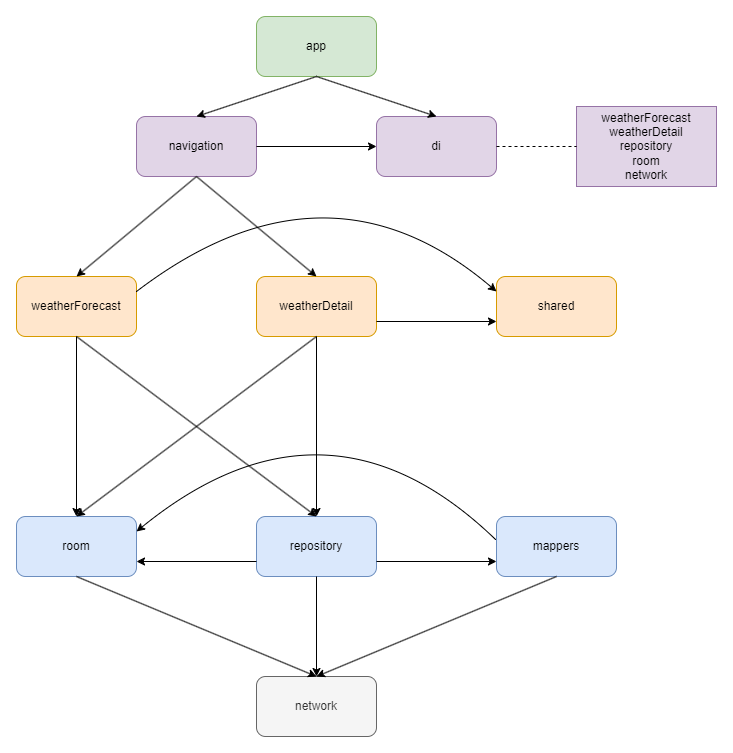

## Running This Project
You will need to obtain your own api key for openweathermap and insert the value into the dead api key
slot in the ApiRoutes.kt file located in the :core:network module. The one provided is dead
and can no longer be used.

## Notable Information
 - At current, the application will cache only the most recently searched forecast. This can be expanded 
   upon in the future to include a per-city forecast instead.

 - The UI is relatively basic, as the focus was to learn/experiment with KTor, Koin, Compose, Room + Flow, and the 
   modularization structure of the layers of the application using them.

 - Unit and integration tests were time-blocked, so although not full coverage, provides some example 
   as to how the project could implement them and how they could be of use.

 - There are some KDocs, but more could be added if dokka were a goal in the future.

 - Opted for simpler gradle structure, but buildSrc + Kotlin DSL would be a good
   option if the project were to grow.

## Module Dependency Graph
Below is a dependency diagram representing the relationships amongst modules in the project.

